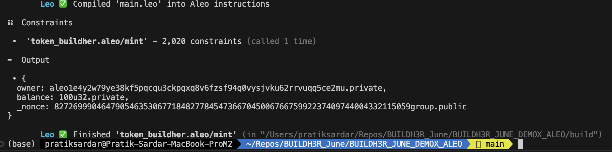
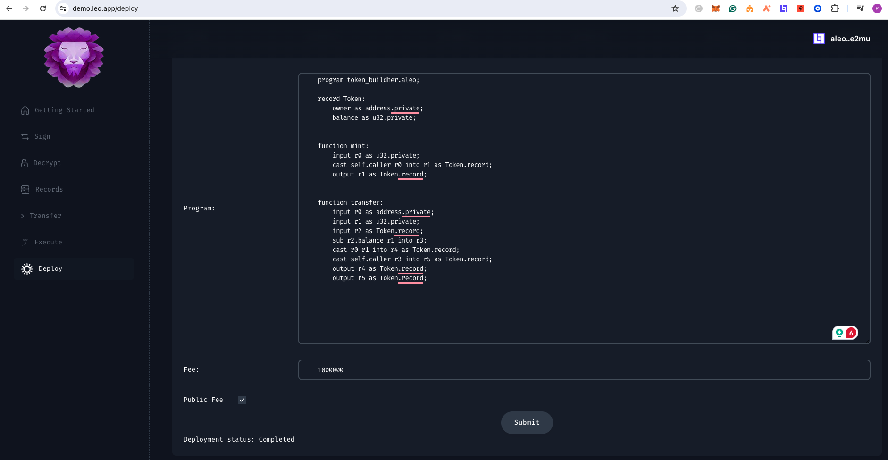
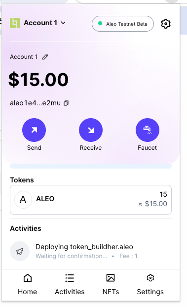

#Buildh3r Demox Leo workshop

# Deployed code via demo : https://demo.leo.app/deploy
## wallet address: aleo1e4y2w79ye38kf5pqcqu3ckpqxq8v6fzsf94q0vysjvku62rrvuqq5ce2mu

#### wallet shows delploying but for several hours does not shows in scanner
