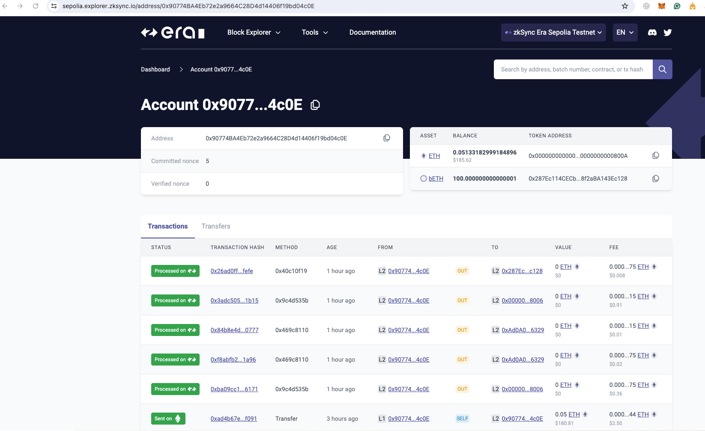
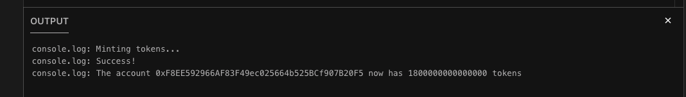

#

## Abstract: 
The Scale Of History On Account Abstraction

Introduction - zkSync Era is a Layer 2 ZK rollup, a trustless protocol that leverages cryptographic validity proofs to enable scalable and low-cost Ethereum transactions. In the zkSync Era, processing and the majority of data storage take place off-chain. Prior to generating a validity proof, transactions are grouped into batches. Because all validity proofs are validated on Ethereum, consumers receive the same security guarantees as in the L1. zkSync Era is designed to look and feel like Ethereum, but with increased throughput and reduced costs. Smart contracts, like those on Ethereum, are written in Solidity/Vyper and may be accessed using the same clients as other EVM-compatible chains.

used : https://zksync.atlaszk.com/ide to perfom the steps
throwaway wallet address: https://sepolia.explorer.zksync.io/address/0x90774BA4Eb72e2a9664C28D4d14406f19bd04c0E
## Step 1 Deployed ZeekSecretMessage contract
### Address: 0x287Ec114CECb05174769CAE0628f2aBA143Ec128

## Step 2 Deploted Test token contract:
### Address : 0xAd0A060661497b14Ede8898f7FBB4aFc6b516329

## Step 3 Minted token to address for new zeek message
Succecceded 

## Step 4 use paymaster transactions to pay gas via generated token 
-- ran into some issue spend few hours but was not able to resolve
